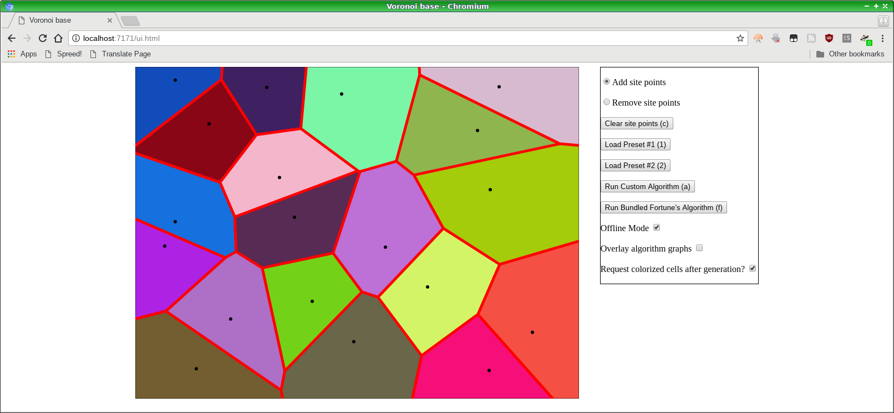

# Voronoi Base

Base code for conducting a new interview experiment: let the interviewer and the candidate try to
come up with and analyze algorithm(s) for generating Voronoi diagrams!

The simple frontend lets the user specify points. Clicking either of the two algorithm buttons
will send the point list up to the server. The server should respond with a Graph data structure
stringified to JSON. The structure contains at a minimum an "edges" property whose data is an array of
line objects, each specified with `{x0: x0, y0: y0, x1: x1, y1: y1}` to define the line between points (x0, y0) and (x1, y1).
See `ui.js` for further details.

Included is an old implementation of the classic Fortune's algorithm to check against. The idea is that using a similar
interface, the interviewer + candidate should be able to work on algorithm(s) generating the same data. Maybe even work
up to an independent implementation of Fortune's Algorithm itself! But it also provides a base framework for the interviewer
to request working code that is easy to verify. e.g. Could ask for an implementation of graph coloring, or just some
proving ground code like generating a Voronoi diagram containing only two points. Can discuss better refactors,
improvements, test coverage. Can discuss augmenting the graph structure with the site data or bounding polygon info or other
things to facilitate coloring, answering geospatial queries, implementing convex hull, etc. Lots and lots of options.



# Usage

This project is composed of two projects.

If you use Eclipse, and have the m2e plugin installed, set up the first project (this one) with:

`File -> Import -> Maven -> Existing Maven Projects -> Select the Voronoi Base folder`

You should see an error about the simplevoronoi project not being found. To fix the error, import that project as well.

`File -> Import -> Maven -> Existing Maven Projects -> Select the simplevoronoi folder`

Once that is done you should be able to launch Application.java.

If you want to use the command line only, you need to run two maven commands.

```
git clone https://github.com/Jach/voronoi_base
cd voronoi_base
cd simplevoronoi
mvn clean install
cd ..
mvn clean package
```

Then you can launch the application with

`mvn exec:java`

and further change-run cycles with `mvn compile exec:java`, alternatively you can just run the uberjar that was packaged:

`java -jar target/voronoi_base-1.0-SNAPSHOT-jar-with-dependencies.jar`

# License

Copyright (c) 2017 Kevin Secretan

Permission is hereby granted, free of charge, to any person obtaining a copy of this software and associated documentation files (the "Software"), to deal in the Software without restriction, including without limitation the rights to use, copy, modify, merge, publish, distribute, sublicense, and/or sell copies of the Software, and to permit persons to whom the Software is furnished to do so, subject to the following conditions:

The above copyright notice and this permission notice shall be included in all copies or substantial portions of the Software.

The Software shall be used for Good, not Evil.

THE SOFTWARE IS PROVIDED "AS IS", WITHOUT WARRANTY OF ANY KIND, EXPRESS OR IMPLIED, INCLUDING BUT NOT LIMITED TO THE WARRANTIES OF MERCHANTABILITY, FITNESS FOR A PARTICULAR PURPOSE AND NONINFRINGEMENT. IN NO EVENT SHALL THE AUTHORS OR COPYRIGHT HOLDERS BE LIABLE FOR ANY CLAIM, DAMAGES OR OTHER LIABILITY, WHETHER IN AN ACTION OF CONTRACT, TORT OR OTHERWISE, ARISING FROM, OUT OF OR IN CONNECTION WITH THE SOFTWARE OR THE USE OR OTHER DEALINGS IN THE SOFTWARE. 
